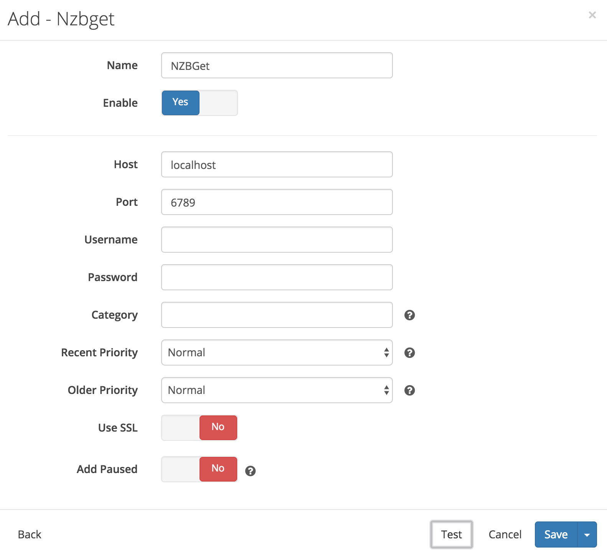
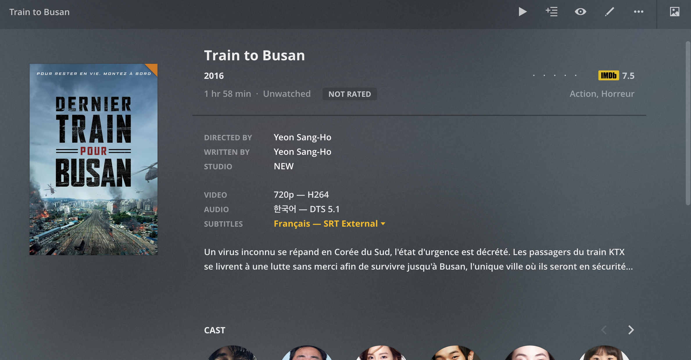

# Setup Radarr

Radarr is a fork of Sonarr, made for movies instead of TV shows. For a good while I've used CouchPotato for that exact purpose, but have not been really happy with the results. Radarr intends to be as good as Sonarr !

## Docker container

Radarr is _very_ similar to Sonarr. You won't be surprised by this configuration.

```yaml
radarr:
  container_name: radarr
  image: linuxserver/radarr:latest
  restart: unless-stopped
  expose:
    - '7878'
  environment:
    - PUID=${PUID} # default user id, defined in .env
    - PGID=${PGID} # default group id, defined in .env
    - TZ=${TZ} # timezone, defined in .env
  volumes:
    - /etc/localtime:/etc/localtime:ro
    - ${ROOT}/config/radarr:/config # config files
    - ${ROOT}/complete/movies:/movies # movies folder
    - ${ROOT}/downloads:/downloads # download folder
  labels:
    - 'traefik.backend=radarr'
    - 'traefik.local.frontend.rule=Host:radarr.localhost'
    - 'traefik.port=7878'
    - 'traefik.enable=true'
```

## Configuration

Radarr Web UI is available on port 7878.
Let's go straight to the `Settings` section.

In `Media Management`, I chose to disable automatic movie renaming. Too bad, but it's helpful for Plex sub-zero plugin to find proper subtitles for the movie (ie. keep that `x264-720p-YIFY` tag to look for the right subtitle). I enable `Ignore Deleted Movies` to make sure movies that I delete won't be downloaded again by Radarr. I disable `Use Hardlinks instead of Copy` because I prefer to avoid messing around what's in my download area and what's in my movies area.

In `Profiles` you can set new quality profiles, default ones are fairly good. There is an important option at the bottom of the page: do you want to give priority to Usenet or Torrents for downloading episodes? I'm keeping the default Usenet first.

As for Sonarr, the `Indexers` section is where you'll configure your torrent and nzb sources.

Nowadays a lot of Usenet indexers are relying on Newznab protocol: fill-in the URL and API key you are using. You can find some indexers on this [subreddit wiki](https://www.reddit.com/r/usenet/wiki/indexers). It's nice to use several ones since there are quite volatile. You can find suggestions on Radarr Newznab presets. Some of these indexers provide free accounts with a limited number of API calls, you'll have to pay to get more. Usenet-crawler is one of the best free indexers out there.
For torrents indexers, I activate Torznab custom indexers that point to my local Jackett service. This allows searches across all torrent indexers configured in Jackett. You have to configure them one by one though.

Get torrent indexers Jackett proxy URLs by clicking `Copy Torznab Feed`. Use the global Jackett API key as authentication.


`Download Clients` tab is where we'll configure links with our two download clients: NZBGet and Deluge.
There are existing presets for these 2 that we'll fill with the proper configuration.

NZBGet configuration:


Deluge configuration:


Enable `Advanced Settings`, and tick `Remove` in the Completed Download Handling section. This tells Radarr to remove torrents from deluge once processed.

In `Connect` tab, we'll configure Radarr to send notifications to Plex when a new episode is ready:


## Give it a try

Let's add a movie !


Enter the movie name, choose the quality you want, and there you go.

You can then either add the movie to the library (monitored movie research will start asynchronously), or add and force the search.

Wait a few seconds, then you should see that Radarr started doing its job. Here it grabed files from my Usenet indexers and sent the download to NZBGet automatically.

You can also do a manual search for each movie, or trigger an automatic search.

When download is over, you can head over to Plex and see that the movie appeared correctly, with all metadata and subtitles grabbed automatically. Applause !



## Movie discovering

I like the discovering feature. When clicking on `Add Movies` you can select `Discover New Movies`, then browse through a list of TheMovieDB recommended or popular movies.


On the rightmost tab, you'll also see that you can setup Lists of movies. What if you could have in there a list of the 250 greatest movies of all time and just one-click download the ones you want?

This can be set up in `Settings/Lists`. I activated the following lists:

- StevenLu: that's an [interesting project](https://github.com/sjlu/popular-movies) that tries to determine by certain heuristics the current popular movies.
- IMDB TOP 250 movies of all times from Radarr Lists presets
- Trakt Lists Trending and Popular movies

I disabled automatic sync for these lists: I want them to show when I add a new movie, but I don't want every item of these lists to be automatically synced with my movie library.
