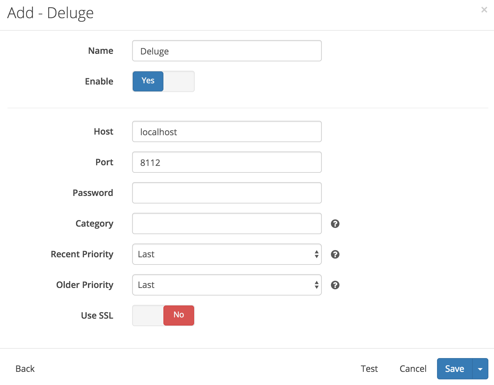
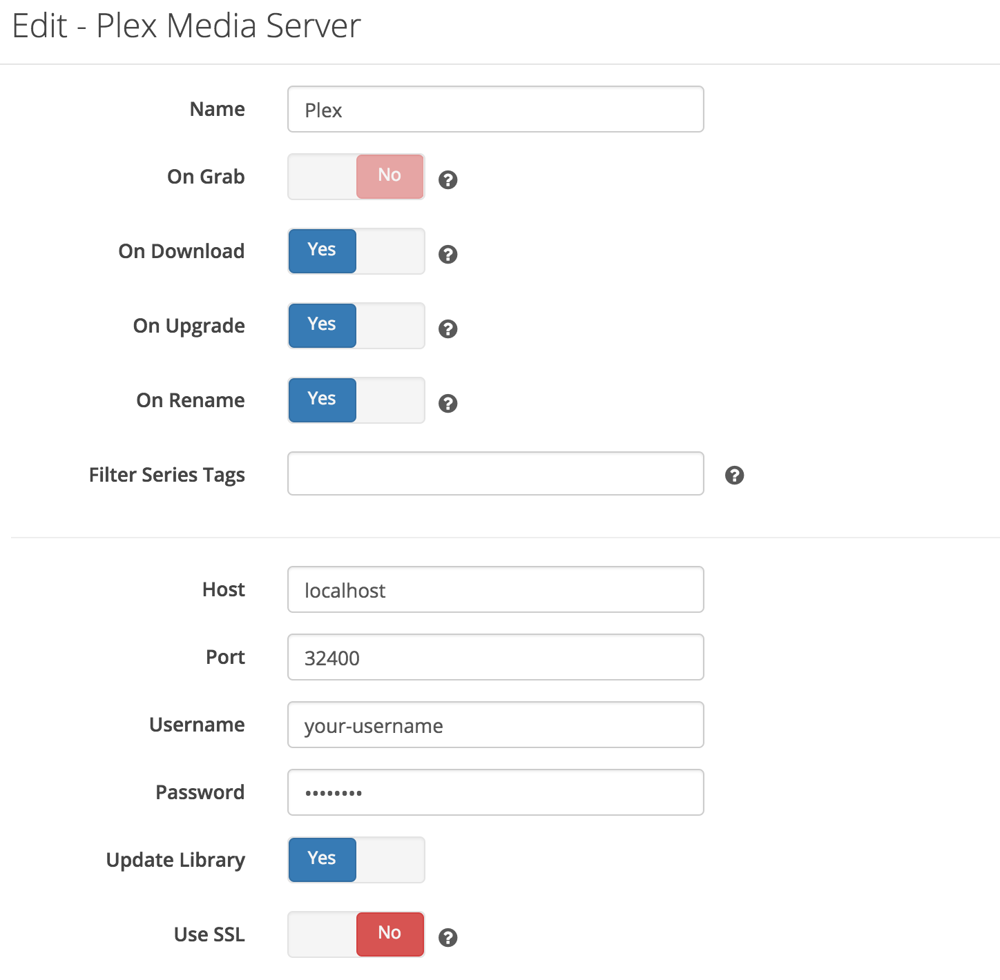
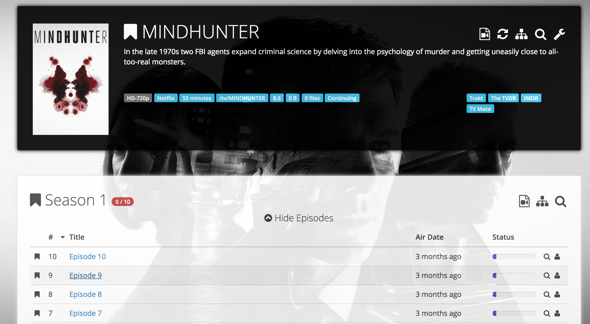
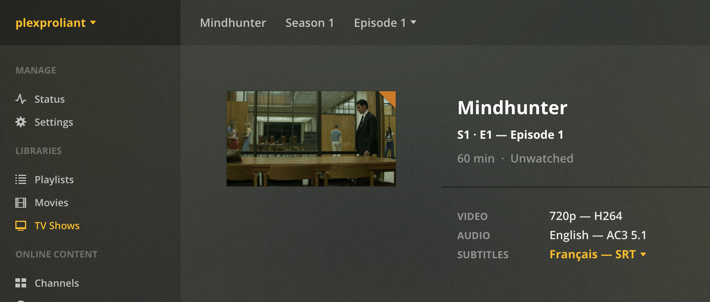

# Setup Sonarr

## Docker container

Guess who made a nice Sonarr Docker image? Linuxserver.io !

Let's go:

```yaml
sonarr:
  container_name: sonarr
  image: linuxserver/sonarr:latest
  restart: unless-stopped
  expose:
    - '8989'
  environment:
    - PUID=${PUID} # default user id, defined in .env
    - PGID=${PGID} # default group id, defined in .env
    - TZ=${TZ} # timezone, defined in .env
  volumes:
    - /etc/localtime:/etc/localtime:ro
    - ${ROOT}/config/sonarr:/config # config files
    - ${ROOT}/complete/tv:/tv # tv shows folder
    - ${ROOT}/downloads:/downloads # download folder
  labels:
    - 'traefik.backend=sonarr'
    - 'traefik.local.frontend.rule=Host:sonarr.localhost'
    - 'traefik.port=8989'
    - 'traefik.enable=true'
```

`docker-compose up -d`

Sonarr web UI listens on port 8989 by default. You need to mount your tv shows directory (the one where everything will be nicely sorted and named). And your download folder, because sonarr will look over there for completed downloads, then move them to the appropriate directory.

## Configuration

Sonarr should be available on `sonarr.localhost`. Go straight to the `Settings` tab.


Enable `Ignore Deleted Episodes`: if like me you delete files once you have watched them, this makes sure the episodes won't be re-downloaded again.
In `Media Management`, you can choose to rename episodes automatically. This is a very nice feature I've been using for a long time; but now I choose to keep original names. Plex sub-zero plugins gives better results when the original filename (containing the usual `x264-EVOLVE[ettv]`-like stuff) is kept.
In `profiles` you can set new quality profiles, default ones are fairly good. There is an important option at the bottom of the page: do you want to give priority to Usenet or Torrents for downloading episodes? I'm keeping the default Usenet first.

`Indexers` is the important tab: that's where Sonarr will grab information about released episodes. Nowadays a lot of Usenet indexers are relying on Newznab protocol: fill-in the URL and API key you are using. You can find some indexers on this [subreddit wiki](https://www.reddit.com/r/usenet/wiki/indexers). It's nice to use several ones since there are quite volatile. You can find suggestions on Sonarr Newznab presets. Some of these indexers provide free accounts with a limited number of API calls, you'll have to pay to get more. Usenet-crawler is one of the best free indexers out there.

For torrents indexers, I activate Torznab custom indexers that point to my local Jackett service. This allows searches across all torrent indexers configured in Jackett. You have to configure them one by one though.

Get torrent indexers Jackett proxy URLs by clicking `Copy Torznab Feed` in Jackett Web UI. Use the global Jackett API key as authentication.


`Download Clients` tab is where we'll configure links with our two download clients: NZBGet and Deluge.
There are existing presets for these 2 that we'll fill with the proper configuration.

NZBGet configuration:


Deluge configuration:


Enable `Advanced Settings`, and tick `Remove` in the Completed Download Handling section. This tells Sonarr to remove torrents from deluge once processed.

In `Connect` tab, we'll configure Sonarr to send notifications to Plex when a new episode is ready:


## Give it a try

Let's add a series !


_Note: You may need to `chown -R $USER:$USER /path/to/root/directory` so Sonarr and the rest of the apps have the proper permissions to modify and move around files._

Enter the series name, then you can choose a few things:

- Monitor: what episodes do you want to mark as monitored? All future episodes, all episodes from all seasons, only latest seasons, nothing? Monitored episodes are the episodes Sonarr will download automatically.
- Profile: quality profile of the episodes you want (HD-1080p is the most popular I guess).

You can then either add the serie to the library (monitored episode research will start asynchronously), or add and force the search.



Wait a few seconds, then you should see that Sonarr started doing its job. Here it grabed files from my Usenet indexers and sent the download to NZBGet automatically.


You can also do a manual search for each episode, or trigger an automatic search.

When download is over, you can head over to Plex and see that the episode appeared correctly, with all metadata and subtitles grabbed automatically. Applause !


